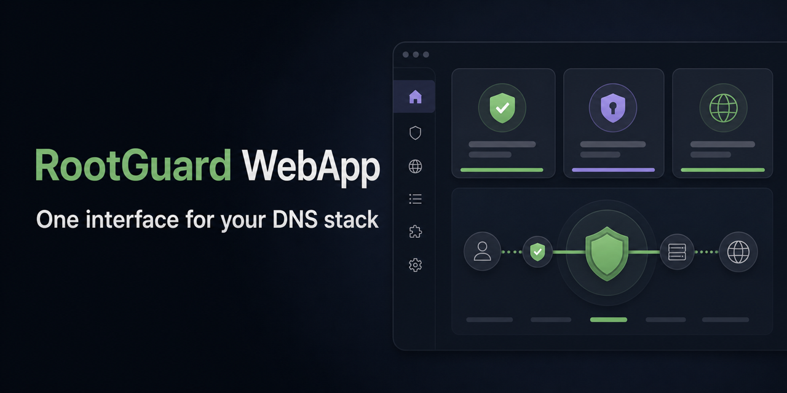

# RootGuard WebApp

> [!IMPORTANT]
> This repository is archived. Development moved to the
> [`rootguard` monorepo](https://github.com/foxly-it/rootguard/tree/main/rootguard-webapp)
> (`rootguard-webapp/` directory) — full history preserved there.



**RootGuard WebApp is the secure browser interface for the RootGuard
self-hosted DNS stack.** It provides guided setup, service health, Unbound
configuration, AdGuard Home access, updates, rollback, and local password
recovery without receiving the Docker socket.

[](https://github.com/foxly-it/rootguard-webapp/actions/workflows/build.yml)
[](frontend/package.json)
[](backend/go.mod)
[](LICENSE)

[RootGuard](https://github.com/foxly-it/rootguard) ·
[Live product view](https://rootguard.foxly.de/) ·
[Manual](https://rootguard.foxly.de/docs.html) ·
[Roadmap](https://rootguard.foxly.de/roadmap.html)

> [!IMPORTANT]
> The WebApp is one component of RootGuard. Use the
> [versioned Compose quick start](https://github.com/foxly-it/rootguard#quick-start)
> to evaluate the complete stack.

## What users get

- Guided all-in-one setup with non-mutating preflight checks and persistent
  progress.
- A dashboard based on real installation, container, DNSSEC, and upstream
  health.
- Guided and expert Unbound configuration with preview, validation, history,
  diagnostics, and rollback.
- Protected access to the native AdGuard Home interface without a separate
  public administration port.
- Controlled service and control-plane updates with visible status.
- German and English UI plus local token-based password recovery.

```text
Browser → WebApp (Go + React) → token-protected Core API → DNS services
```

## Local development

### Backend

```sh
cd backend
ROOTGUARD_CORE_URL=http://localhost:8081 \
ROOTGUARD_API_TOKEN=development-token \
ROOTGUARD_ADMIN_PASSWORD=replace-with-a-strong-password \
ROOTGUARD_RECOVERY_TOKEN=separate-long-random-recovery-key \
go run ./cmd/rootguard-webapp
```

### Frontend

```sh
cd frontend
npm ci
npm run dev
```

Run the checks before opening a pull request:

```sh
cd backend && go test ./...
cd ../frontend && npm ci && npm run lint && npm run build
```

The full RootGuard development stack is available from the
[main repository](https://github.com/foxly-it/rootguard).

## Architecture and security

The Go backend owns authentication, sessions, same-origin checks, API proxying,
and static frontend delivery. The React frontend contains presentation and
guided workflows.

- No Docker socket or arbitrary host command execution.
- HttpOnly, SameSite-Strict sessions.
- Internal Core and updater calls use a separate API token.
- Distroless runtime image and deterministic frontend build.
- Password resets require an independent local recovery token, store only a
  salted verifier, and invalidate existing sessions.

The complete trust model is documented in the
[RootGuard architecture](https://github.com/foxly-it/rootguard/blob/main/docs/architecture.md).

## Contributing

Read [CONTRIBUTING.md](CONTRIBUTING.md) before opening a pull request. Good
starting points are issues labeled
[`good first issue`](https://github.com/foxly-it/rootguard-webapp/labels/good%20first%20issue)
or [`help wanted`](https://github.com/foxly-it/rootguard-webapp/labels/help%20wanted).
Visible changes should include a screenshot. Report vulnerabilities privately
through [SECURITY.md](SECURITY.md).

## License

RootGuard WebApp is licensed under
[GNU AGPL-3.0-or-later](LICENSE). The software license does not grant rights to
the RootGuard or Foxly IT names or logos.
